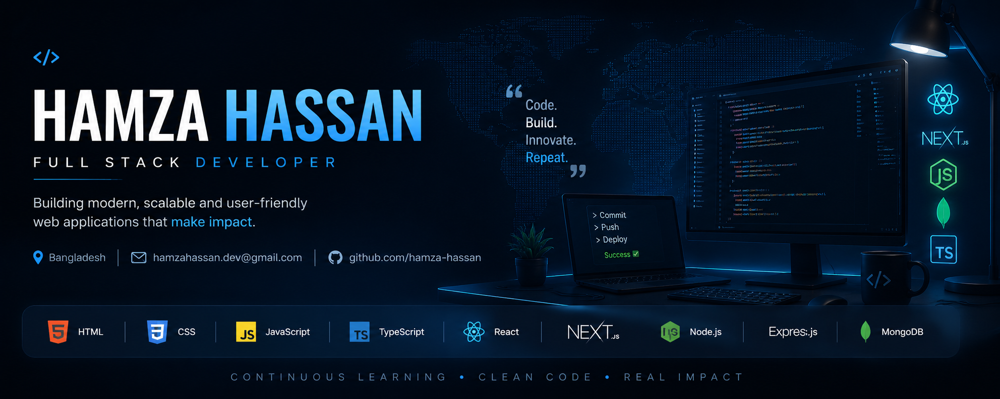

  

<h1 align="center">Hi 👋, I'm Hamza Hassan</h1>

<h3 align="center">
Full Stack Web Developer | React • Next.js • TypeScript • Node.js
</h3>

I build modern, scalable and user-friendly web applications that solve real-world problems.

---

# 🚀 About Me

I'm a passionate Full Stack Web Developer from Bangladesh with a strong interest in building fast, responsive and scalable web applications.

I enjoy turning ideas into real products using modern JavaScript technologies while continuously learning new tools and best practices.

- 💻 Full Stack Web Developer
- 🌱 Currently learning Advanced Next.js
- 🔥 Passionate about Clean Code
- 🤝 Open to Frontend & Full Stack Opportunities

---

# 💼 Current Activities

- 🚀 Building Full Stack Web Applications
- 🌱 Exploring Advanced Next.js
- 📚 Learning Backend Architecture
- ⚡ Improving Problem Solving Skills
- 💼 Looking for Internship & Junior Developer Roles

---

# 🛠 Tech Stack

### Frontend

### Backend

### Tools

---

# 📌 Featured Projects

## 🚀 StartupForge

Startup Team Builder Platform where founders and developers collaborate.

**Tech Stack**

- Next.js
- TypeScript
- Tailwind CSS
- Node.js
- Express.js
- MongoDB

🔗 Live Demo:
https://your-live-link.com

---

## 💡 IdeaVault

Modern platform for collecting and managing innovative ideas.

**Tech Stack**

- Next.js
- TypeScript
- MongoDB
- Better Auth

🔗 Live Demo:
https://your-live-link.com

---

## 📚 Book Store

Responsive online bookstore with authentication and modern UI.

**Tech Stack**

- React
- Firebase
- Tailwind CSS

🔗 Live Demo:
https://your-live-link.com

---

# 📊 GitHub Statistics

---

# 📫 Contact

📍 **Location:** Dhaka, Bangladesh

📧 **Email:** hamzahassan.dev@gmail.com

💼 **LinkedIn:** https://linkedin.com/in/hamza-hassan-1b66403b6

🐙 **GitHub:** https://github.com/hamza_hassan

---

# 💬 Favourite Quote

> **"Code. Learn. Build. Repeat."**

---

### Thanks for visiting my profile ❤️

If you like my work, consider giving a ⭐ to my repositories.

